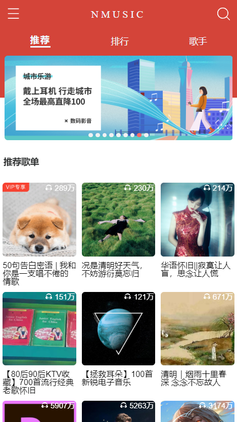
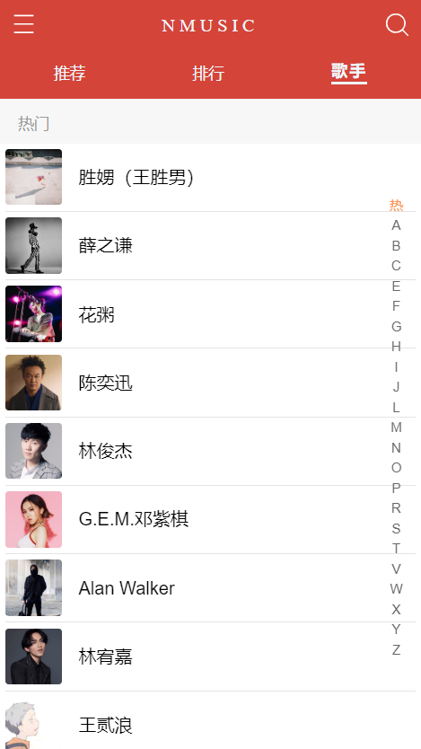
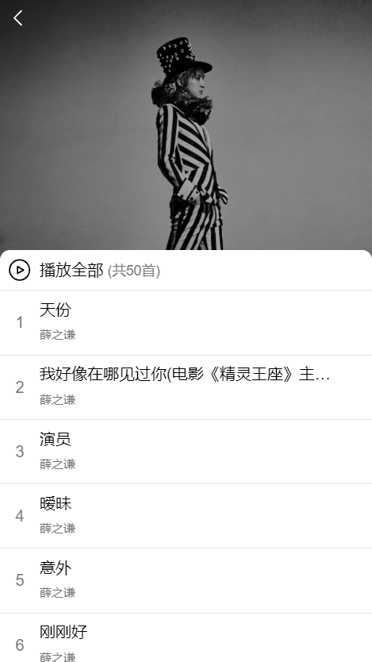
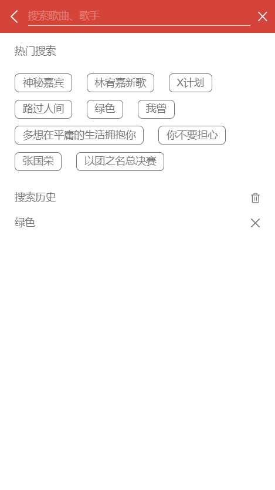
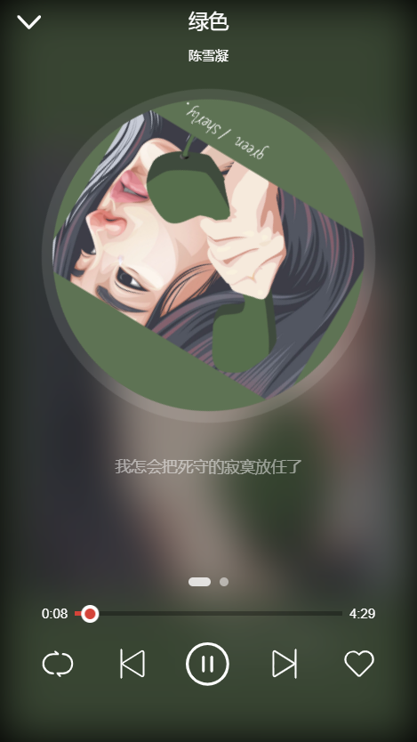
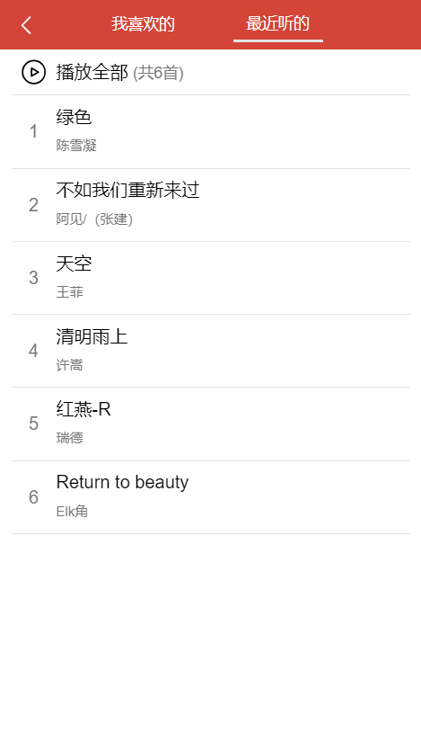

## 网易云播放器
***

**基于 Vue 3.0 + vue-router + vuex + axios + cube-ui + Scss + ES6 以网易云音乐为主题的移动端项目, UI 页面参考了已有的项目[Vue 网易云音乐 WebApp]。**

项目演示地址: [项目演示地址](http://tea.hhp.im/),或者可以扫描下方二维码访问。

电脑预览的话请使用 Chrome 的手机模式，刚刚进入手机模式可能无法上下滑动，刷新一下即可。

### 图片预览
***

### 感谢
***

- 感谢[NeteaseCloudMusicApi](https://binaryify.github.io/NeteaseCloudMusicApi/#/?id=neteasecloudmusicapi)项目作者们对项目的制作与维护。
- 感谢前辈[caijinyc](https://github.com/caijinyc),他的[网易云项目](https://github.com/caijinyc/vue-music-webapp)是真的棒，见贤思齐，才有了这个项目。
- 感谢[ustbhuangyi](https://github.com/ustbhuangyi)老师录制的[课程](http://coding.imooc.com/class/107.html)，让我对 Vue 有了更深的理解。
